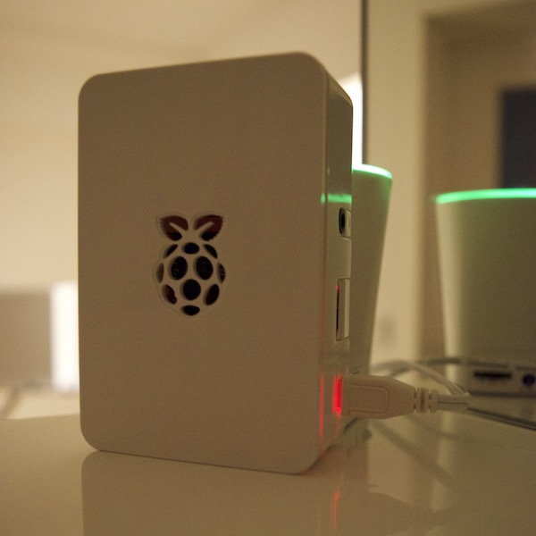

# Welcome Home with Synthia

*Authors: [Geoff Khorn](https://github.com/gkhorn978), [Sarah Carroll](https://github.com/sarahes), and [Tom Carroll](https://github.com/TomAlanCarroll)*

Synthia is a Synthetic Intelligent Assistant for your home.

We love to give our homes unique personality with furniture, decor and lighting. But what if we could take that personalization futher and interact with our homes?

Synthia is an intelligent assistant that sends you off in the morning with helpful reminders, then welcomes you home at the end of each day. This is done using motion detection triggered by a camera built into a Raspberry Pi. If motion is detected within a certain time range in the morning or evening, it will trigger functions to play a customized message.

Synthia is written in Python 2.7.

## Prerequisites
1. Raspberry Pi 3 Model B with Raspbian Jessie
1. Pi NoIR camera
1. Bluetooth speaker (or 3.5mm powered speaker)
<div align="center"></div>

## Setup
1. Install Python 2.7 on Raspberry Pi
1. Install OpenCV on the Raspberry Pi with [OpenCV-for-Pi](https://github.com/jabelone/OpenCV-for-Pi) (or if you want to compile OpenCV on the Pi: http://www.pyimagesearch.com/2016/04/18/install-guide-raspberry-pi-3-raspbian-jessie-opencv-3)
1. Install `virtualenv` for Python if you have not already done so by running `sudo pip install virtualenv`.
1. Run the following commands to setup `virtualenv` within this repository folder on the Raspberry Pi:
```bash
sudo apt-get install python-dev

# Needed for text-to-speech
sudo apt-get install mpg321

# Setup virtualenv (change directory to repository directory if you haven't already)
virtualenv --no-site-packages synthia-virtualenv
source synthia-virtualenv/bin/activate

# You may need portaudio19-dev because of PyAudio
sudo apt-get install portaudio19-dev
pip install --allow-unverified=pyaudio pyaudio

# Install pip modules (this could take a while):
pip install -r requirements.txt

# Install OpenCV in virtualenv (OpenCV-for-Pi does not work in virtualenv by default)
wget "https://github.com/jabelone/OpenCV-for-Pi/raw/master/latest-OpenCV.deb"
dpkg -x latest-OpenCV.deb ./OpenCV
cp OpenCV/usr/local/lib/python2.7/dist-packages/cv2.so synthia-virtualenv/local/lib/python2.7/site-packages/
rm latest-OpenCV.deb
rm -rf OpenCV
```
1. Configure the desired audio output device as the system's default on the Raspberry Pi

# How to Run
Execute the following line on the Raspberry Pi:
```bash
python synthia.py --conf conf.json
```
The default configuration is to each day execute exactly one morning event between 6:00 and 10:00  and exactly one welcome home event between 18:00 and 23:00. These times are relative to the current time on the Raspberry Pi.
